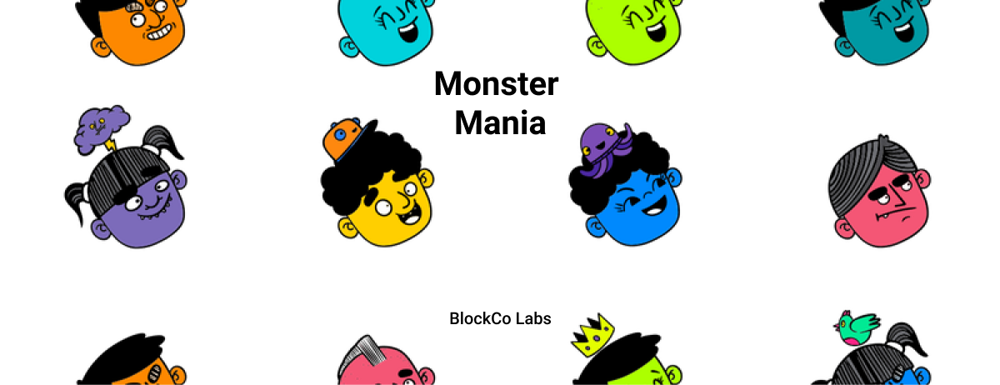

WIP!



<br/>

👋 Welcome! This demo app is created for [BlockCo Labs](https://www.blockcolabs.com/) NFT SaaS Platform. 
- **Monster Mania** is a collection game that uses BlockCo APIs for following use cases -
  - Account Creation
  - Token Refresh
  - NFT Creation
  - NFT Retrieval
  - NFT Transfer
  - NFT Deletion
- It's a full-stack app based on MERN stack.

<br/>

# BlockCo APIs Usage

#### Just want to take a sneek peak on how to use use BlockCo APIs ?
  - Account Creation API call example
  - Token Refresh API call example
  - NFT Creation API call example
  - NFT Retrieval API call example
  - NFT Transfer API call example
  - NFT Deletion API call example

#### Are you an explorer and want to run the whole app in local ?

Follow the steps given here to run whole app in local.

<br/>

# Game 

### Live Demo
Checkout the live demo of Monster Mania app here.

### Description

Monster Mania is a collection game in which one can win a <b>random</b> Monster NFT daily! There are a total of 10 <b>unique</b> monsters.

 Your goal is to collect all the 10 unique monster NFTs. Once you have completed the collection, you'll win a <b>King Monster NFT</b> to rule the monster world.


<br/>

# Getting Started

 Steps to run it locally

### 1. Clone the project
```
git clone https://github.com/blockcolabs/monster-mania.git
```

### 2. Update .env files
Complete the steps given in [Prerequisites](https://github.com/blockcolabs/monster-mania/tree/dev#prerequisites) to update `env` files in frontend and backend of project.

### 3. Start Backend
  Use the following steps to start backend -
  1. Change into backend folder
      ```
      cd backend
      ```
  2.  Install all the required dependencies
      ```
      yarn
      ```
  3.  Start the project 
      ```
      nodemon server
      ```
  4.  Go to `localhost:5000`

### 4. Start Frontend
  Open a new terminal and enter following steps to start frontend -
  1. Install all the dependencies
      ```
      yarn
      ```
  2. Start the project 
      ```
      yarn start
      ```
  3. Go to `localhost:3000`

### 5. Mint Monsters
Follow the steps given in [Minting monsters](https://github.com/blockcolabs/monster-mania/tree/dev#minting-monsters) section to mint the monsters to play the game.

### 6. Enjoy playing Monster Mania! 
Sign up using a new username and start playing.

<br/>

# Prerequisites 
Complete the prerequisites for each of the following parts before trying this app in local.

### 1. BlockCo APIs

  In order to run this demo app in your local, you need to obtain developer credentials. Please contact BlockCo Labs team to obtain test developer credentials.

### 2. Backend
Copy the content of `.env.default` file to a new `.env` and update the required environment variable(s). Note the following points before updating env variables :
  - We are hosting our database using [MongoDB Atlas](https://www.mongodb.com/cloud/atlas). You can create a new test account in MongoDB Atlas and update the `ATLAS_URI` obtained in backend's .env file.
  - `ENCRYPTION_SECRET` is required by mongoose-encryption to encrypt passcode and password
  - `DEVELOPER_PRIVATE_KEY`, `DEVELOPER_ID` and `EXTERNAL_ID` will be provided by BlockCo team as part of your developer credentials
  - `DEVELOPER_ACCOUNT` is basically the developer username. You can choose any username. Same can be used in .env file of frontend.

### 3. Frontend
Copy the content of `.env.default` file to a new `.env` file and update the required environment variable(s).
  - `REACT_APP_DEVELOPER_ACCOUNT` is same as `DEVELOPER_ACCOUNT` used in `backend/.env`.


<br/>

# Minting Monster NFTs

In order to mint monsters, you'll need to sign up as admin. Use same username as `DEVELOPER_ACCOUNT` and enter a suitable password. It'll open a page for you where you can select the monster and number of editions to be minted for that monster. All the monsters will be minted to blockchain account corresponding to `DEVELOPER_ACCOUNT`. After you've minted enough NFTs you can logout and then login back as a new user.
```
⚠️ Make sure you've minted enough number of monsters before trying out the actual game otherwise game will not work properly 
```

<br/>

# Acknowledgement

### Monster Images
We are using Blush Design's [Street Life](https://blush.design/collections/2q77tcQgOR3gUha4oprc/street-life) Collection by [YONG](https://blush.design/artists/YONG).
